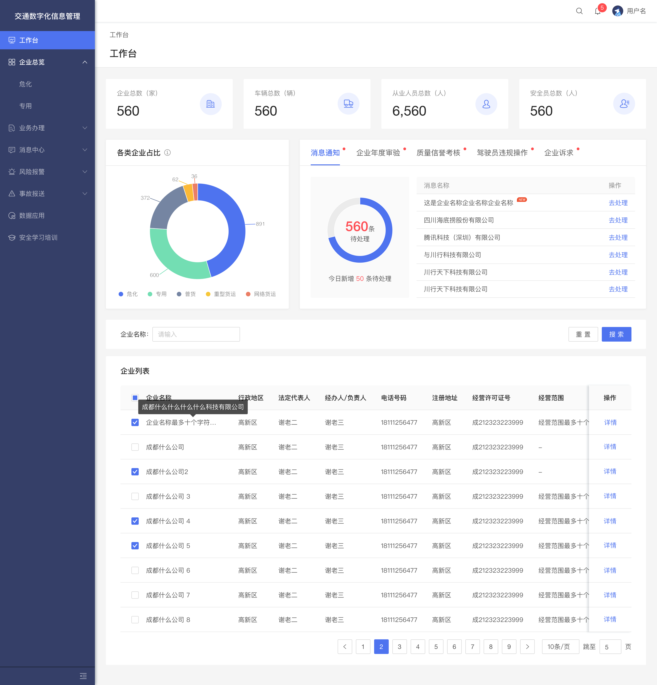

# 实现下方界面（忽略侧边栏）




#### 注意：必须使用vue3 + ts, 使用当前框架实现以下功能

要求：
- 企业总数，车辆总数，从业人员总数，安全员总数上方模块需提取组件，再进行数据渲染
- 消息通知待处理数最大不超过30条
- Tabs 无数据需做缺省页提醒
- 企业列表
    1. 可忽略勾选操作
    2. 必须使用框架现有封装table组件
    3. 至少实现不低于一项筛选项，不使用接口，前端进行筛选
```
接口地址： src/mock/index
接口处理： src/api/module/dashboard
页面实现路由：/dashboard/console
table组件：src/component/table
```

完成之后发送项目压缩包至：wangting@uconcern.com 格式为：姓名（联系方式）+岗位+日期 如：张三（13123458888）+前端+2023-05-21
